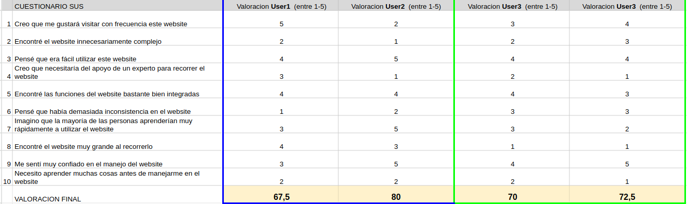
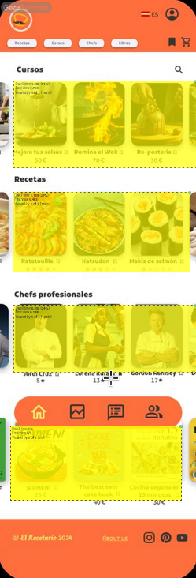
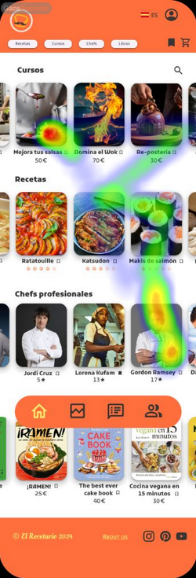
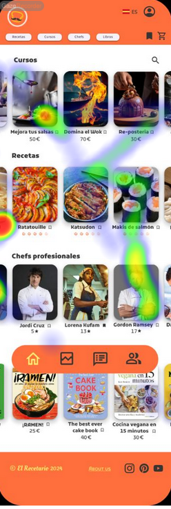
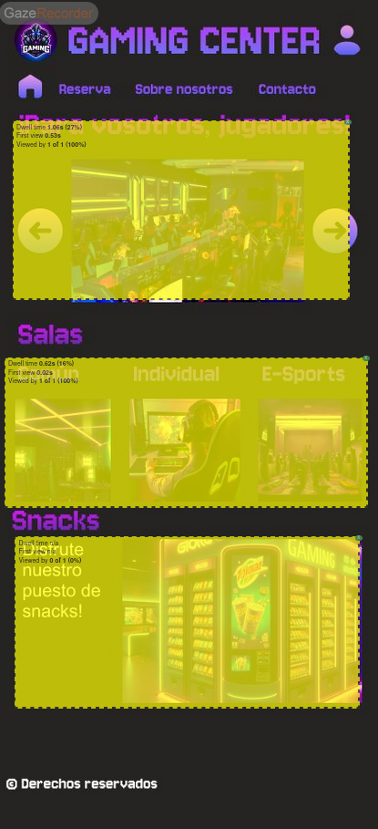
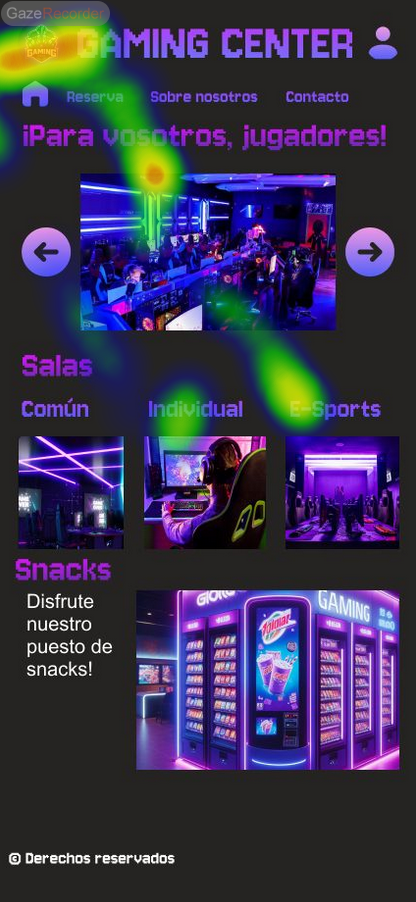
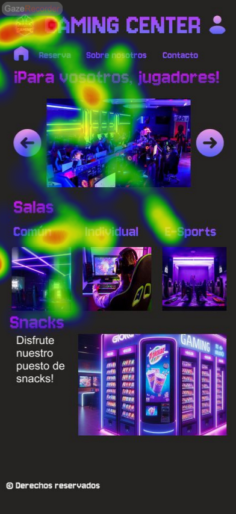

# Usability Report

#### Evaluación de usabilidad del proyecto 

### Gaming Center

### (30/05/2024)

Enlace GitHub: https://github.com/AntonioFdez03/PracticasDIU

### Realizado por:

Informe realizado por Equipo DIU1_Jorses.

## 1 DESCRIPCIÓN DEL WEBSITE

El propósito de la app revisada es proporcionar experiencias inmersivas en salas comunes o individuales de diferentes videojuegos a elección, ofertando un lugar con las comodidades necesarias para disfrutar del mundo del mundo del gaming.

 

## 2 RESUMEN EJECUTIVO

El proyecto trata de un club de videojuegos dedicado a expandir y explorar nuevos géneros dentro del mundillo, tanto a nivel de usuario como a nivel de producto. Para ello, se ofrecen diferentes salas especializadas (común, individual o e-sport) en las que los distintos usuarios pueden hacer uso de las experiencias ofertadas. Todo ello está sustentado mediante un diseño visual moderno y tecnológico, con una paleta de colores cuya base es el morado, y una tipografía que recuerda a los píxeles de un ordenador, un toque bastante acertado.
la tipografía

Algunos de los problemas detectados podrían ser la ausencia de algún color de contraste, pues todos los usados resaltan sobre fondo negro pero no se diferencia un color del resto si se quiere dar énfasis, y el uso de una segunda tipografía para la web que no encaja con la dinámica visual.

## 3 METODOLOGIA 

#### Metodología de usabililidad

Las técnicas aplicadas han sido varias. Se han construido 4 perfiles ficticios con distintos rasgos, atribuidos de forma aleatoria lanzando unos dados especiales. A través de esto conseguimos tener 4 puntos de vista distintos sobre la aplicación "Gaming Center",  retratado claramente en las conclusiones del cuestionario SUS. 

También hemos utilizado una herramienta de Internet, "Gaze recorder", cuya tecnología obtiene los puntos principales a los que mira el sujeto y así saber si el diseño de dicha aplicación cumple con sus propósitos.

#### Test de usuarios: Participantes

| Usuarios | Sexo/Edad     | Ocupación      |  Exp.TIC    | Personalidad | Plataforma | TestA/B
| ------------- | -------- | -----------    | ----------- | -----------  | ---------- | ----
| Ana      | M  | 63       | Bibliotecaria  | Baja        | Emocional    | Móvil      | A 
| Carlos   | H  | 35       | Gerente        | Alta        | Extrovertido | Linux      | A 
| Lucia    | M  | 28       | Desempleada    | Media       | Introvertida | Windows    | B 
| Jorge    | H  | 42       | Fotógrafo      | Alta        | Racional     | Mac        | B 

Descripción: Ana es una mujer de 68 años que ha trabajado como bibliotecaria toda su vida. Siempre ha sido una persona introvertida, encontrando su mayor satisfacción en la lectura y en la tranquilidad de su hogar. Ana disfruta pasando tiempo con sus nietos y ayudando a su hija con las tareas del hogar. Se siente inmensamente feliz cuidando su jardín y horneando pasteles para su familia. Ana ha decidido dedicar su jubilación a disfrutar de actividades que le traen alegría, como asistir a clases de baile para mayores y organizar reuniones familiares llenas de risas y buenos momentos.

Descripción: Carlos es un hombre de 35 años que trabaja como gerente de ventas en una gran empresa. Es muy social y le encanta salir con amigos y conocer gente nueva. Sin embargo, últimamente se siente asqueado por la rutina y el estrés de su trabajo. Para evadirse, Carlos ha comenzado a practicar senderismo los fines de semana y a planificar escapadas de fin de semana a lugares tranquilos. También ha empezado a asistir a eventos culturales y conciertos para despejar su mente y relajarse.

Descripción: Lucía es una joven de 28 años que ha vivido con una discapacidad física desde su nacimiento. Es introvertida y pasa mucho tiempo en casa, disfrutando de su propio espacio y actividades solitarias como la lectura y la pintura. Motivada por su deseo de superación personal y de abrirse nuevas oportunidades, Lucía ha decidido aprender japonés. Cada día dedica tiempo a estudiar el idioma, soñando con el día en que pueda visitar Japón y comunicarse fluidamente con los locales.

Descripción: Jorge es un hombre de 42 años, muy social y cercano a su gran familia. Trabaja como fotógrafo freelance y le encanta capturar momentos especiales en bodas, fiestas familiares y eventos comunitarios. Aunque ama su trabajo, a veces solo quiere pasar el rato sin preocupaciones. Los fines de semana, Jorge disfruta de reunirse con amigos para tomar algo y charlar, y a menudo se lleva su cámara para capturar fotografías espontáneas de sus seres queridos y de la vida cotidiana, simplemente disfrutando el momento sin presiones.

#### Resultados obtenidos

Los resultados obtenidos corresponden al orden de presentación de los usuarios en la tabla, correspondiéndose Ana y Carlos al test A (Nuestro Proyecto) y Lucía y Jorge al test B (Proyecto a evaluar):

Los resultados del eye tracking en los diferentes test son los siguientes. Para el test A:

Y para el test B:

## 4 CONCLUSIONES 

A partir de los resultados de las pruebas de usabilidad efectuadas a lo largo de esta práctica, hemos podido extraer varias conclusiones:

- Es una buena idea de proyecto, sin embargo la ejecución/diseño de la app no la consideramos la mejor, sino que podría haberse desarrollado bastante más. 

- Buena temática y colores elegidos, así como una tipografía muy acertada.

- Readme poco relleno.

#### Incidencias

* En la parte del User Flow, solo está descrita una acción, en contraste a las tres mínimamente requeridas.

#### Valoración 

* Buena temática y los colores son muy acertados y acorde al tema elegido. La tipografía, consideramos que es de las mejores que se podrían haber usado. Además, los iconos elegidos son simples, pero funcionan muy bien.

* Buen diseño para realizar la eleccion de los datos de las reservas (uso de varios patrones IU, como campos de texto o elección de hora).

#### Recomendaciones y propuesta de mejoras: 

* Readme poco relleno. Deberían de ponerse comentarios y especificaciones en diferentes partes del readme que no se encuentran rellenas (como conclusiones o comentarios a fotos que no están).

* Las paginas de "Contáctanos" y "Sobre nosotros" varían algo con los wireframes especificados en la práctica anterior y, aunque pueden haber cambiado de opinión, creemos que deben de servir de base para el diseño final.

#### Valoración de la prueba de usabilidad (self-assesment)

Consideramos que estas técnicas si han sido bastanate útiles a la hora de evaluar el diseño y la usabilidad de la aplicación. Esto ha servido para ofrecer un punto de vista diferente, lo que ayuda a hallar fallos que bajo una percepción del creador no podrían ser detectados y mejorar aspectos que no hubieran sido considerados.
