# DIU24
Prácticas Diseño Interfaces de Usuario 2023-24 (Tema: Espacio Escénico Teatral) 

Grupo: DIU1-Jorses.  Curso: 2023/24 
Updated: 25/4/2024

Enlace GitHub: https://github.com/DIU1-Jorses/DIU_P

**Proyecto:** 
# El Recetario

**Descripción:**  
**El Recetario** es una app que celebra tanto la innovación como la autenticidad culinaria, proporcionando una amplia variedad de recetas de diferentes culturas con solo un clic. Además, ofrece una variedad de cursos y eventos gastronómicos, desde clases de cocina oriental hasta talleres de repostería. Nos esforzamos por crear experiencias únicas que permitan a los usuarios sumergirse y aprender sobre la gastronomía de distintas culturas.

Nuestro proyecto consiste en crear una web relacionada con el tema de la gastronomía, cuyo objetivo es asentarse en el mercado, ofreciendo innovación y accesibilidad sencilla y cómoda para nuevos o conocidos públicos. Para ello, recogemos muchas de las necesidades e ideas de usuarios interesados en el tema para sintetizarlas en un sitio web en el que se recogen ideas de recetas, libros y cursos de cocina o interacción con otros usuarios.

Nuestra misión es hacer que la cocina sea accesible, divertida y gratificante para todos. Creemos que cualquiera puede ser un gran cocinero con las recetas adecuadas y un poco de orientación. Por eso, nos esforzamos por ofrecer contenido de alta calidad que no solo instruye, sino que también inspira.

**Logotipo:** 

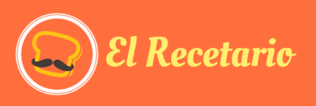

**Miembros**
 * :bust_in_silhouette:   Jose Francisco López Rubio  [jflrubio4](https://github.com/jflrubio4)         
 * :bust_in_silhouette:  Jorge Navarro Molina [jorgenavmol](https://github.com/jorgenavmol)         

----- 

# Proceso de Diseño 

## Paso 1. UX User & Desk Research & Analisis 

 **1.a User Reseach Plan**
-----

En esta parte hemos analizado, bajo diferentes puntos de vista y de forma general, diferentes páginas web para realizar el estudio de su usabilidad. Esto servirá de base para desarrollar el resto del proyecto y, en cierto punto, realizar una mejora sustancial en la experiencia de usuario.

 1.b Competitive Analysis
-----

Queríamos escoger sitios web alejados de la zona de estudio para ver si en otros lugares también sucedían experiencias similares. Por ejemplo, hemos escogido la pagina de OFF ya que considerabamos que era una web digna de competir y con la que poder comparar debido a su diseño limpio y aspecto profesional, y no difería de lo que buscabamos analizar en nuestra web de referencia. Hemos elegido la web La Estupenda por su pobre diseño e interfaz poco intuitiva para estudiar como poder mejorarla.

 1.c Persona
-----

Hemos escogido personas fuera del ámbito teatral y escénico pero con cierto interés en el tema y con diferentes características para enfocarla desde varios puntos de vista.

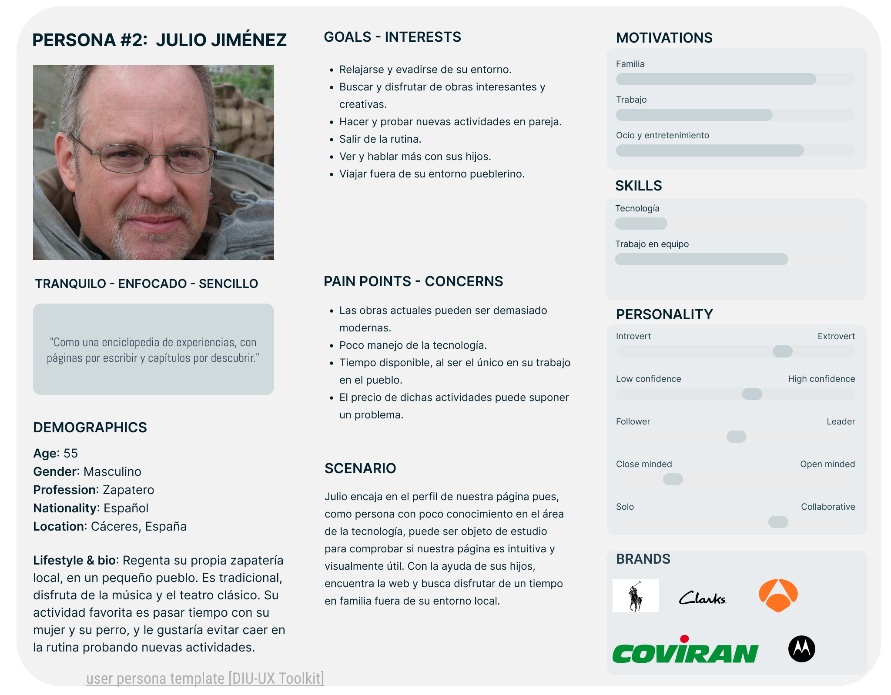
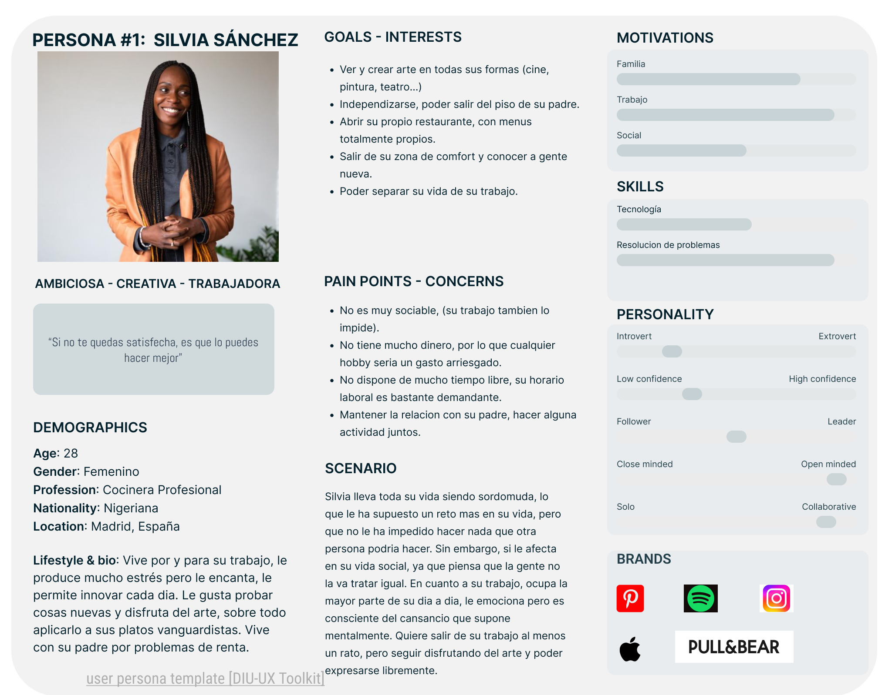

 1.d User Journey Map
----

Consideramos estas experiencias pues, en cuanto al trabajo se refiere, es común y lógico anteponerlo al ocio, y hemos querido basar a nuestras personas desde dicho ámbito para servir de ayuda a otros usuarios.

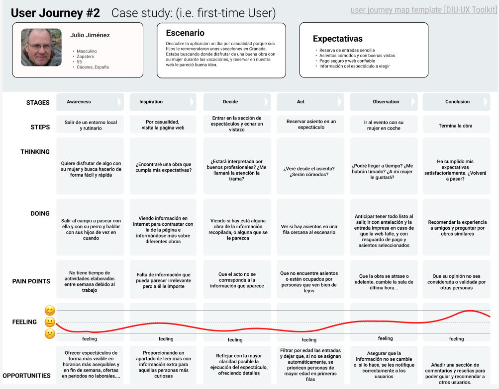
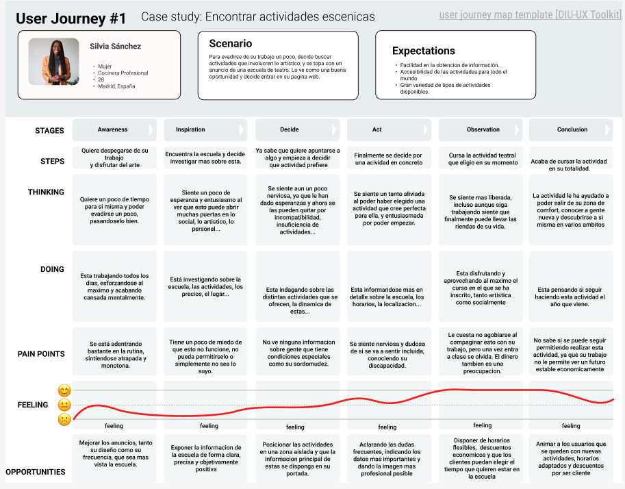

 1.e Usability Review
----
Revisión de usabilidad: 
- Enlace al documento: [Usability Review](P1/4%20-%20Usability%20Review)
- Valoración final (numérica): 63
- Comentario sobre la valoración: La valoracion final es medianamente acpetable, pero bastante mejorable en varios aspectos. Algunos de los puntos mas debiles de la página son el uso obligatorio de un menu interactivo auxiliar, cuya funcionalidad es bastante pobre y podria evitarse de distintas formas, la carencia de ayudas o guias para la navegación por la página web, la vaga organización de la información o la lenta velocidad de la pagina. Y algunos de los puntos mas fuertes de la página son el acceso al sitio web, es decir, es fácilmente encontrable, la claridad con la que se indica la información necesaria a introducir y la facilidad que tiene reservar/apuntarse a una actividad. Es pasable, pero la interfaz principal necesita un cambio urgentemente.

## Paso 2. UX Design  

 2.a Reframing / IDEACION: Feedback Capture Grid / Empathy map 
----

Mediante la anterior práctica, pudimos ver aspectos importantes de una web y realizamos un estudio en diferentes ámbitos de la misma, que nos han servido de base para este nuevo proyecto, tanto qué podría tener o qué se podría mejorar en nuestra página en forma de una malla receptora (Feedback Capture Grid).

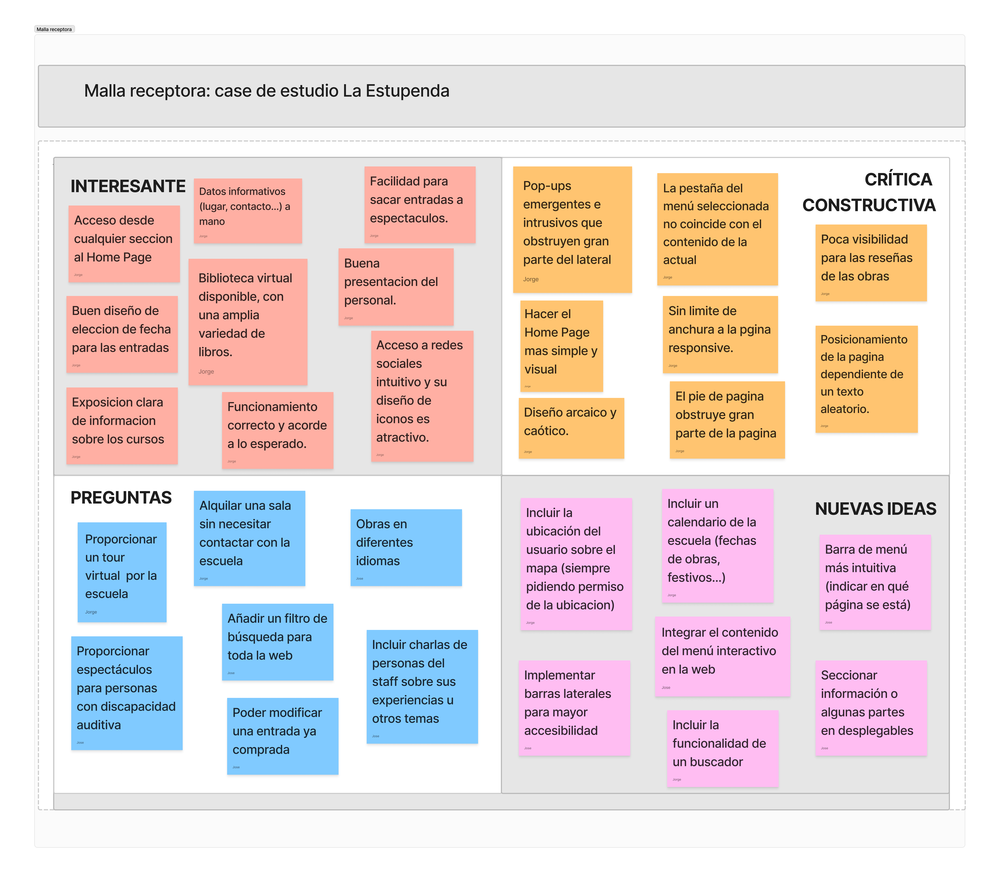
  
    
En esta práctica, planteamos como "propuesta de valor" para un nuevo diseño de aplicación para economia colaborativa una pagina web para una empresa de cocina que ofrece tanto recetas, como cursos de cocina para todos los públicos, además de un portal de venta de libros de recetas que oferta, todo realizado por chefs profesionales y reconocidos en el ámbito gastronómico.

 2.b ScopeCanvas
----
Nuestra propuesta de valor se resume en la siguiente imagen:

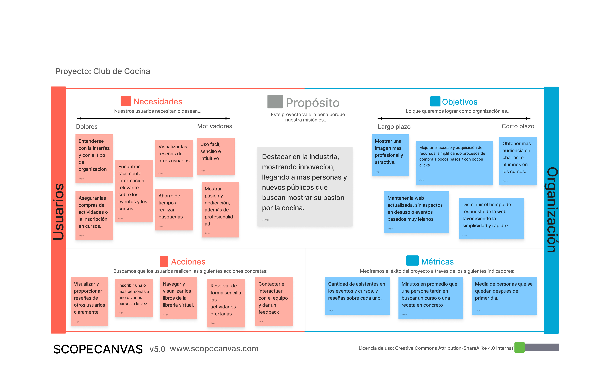

 2.b User Flow (task) analysis 
-----

A continuación, hemos identificado tareas principales, junto a su relevancia, para diferentes grupos de personas que pueden acceder a nuestro sitio web, así como desarrollado 3 de ellas en varios User Flows:

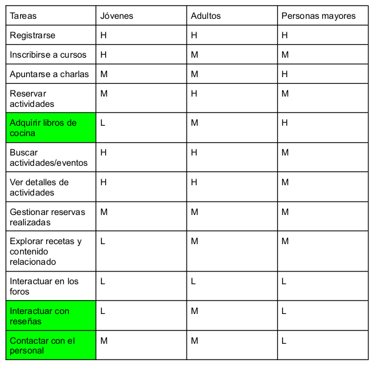
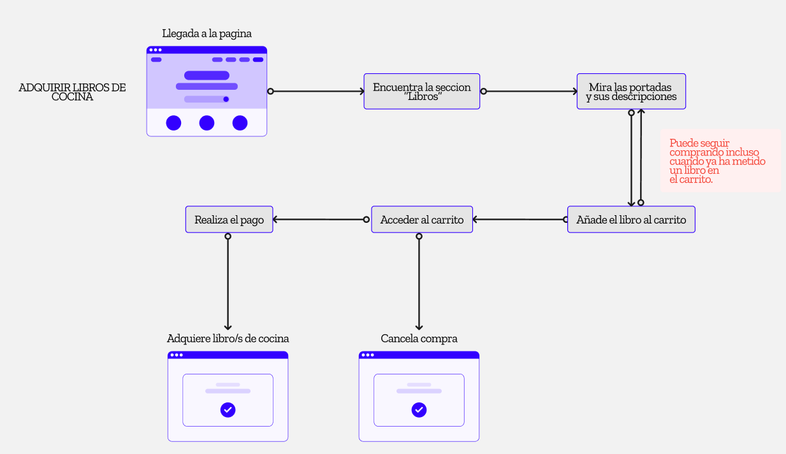
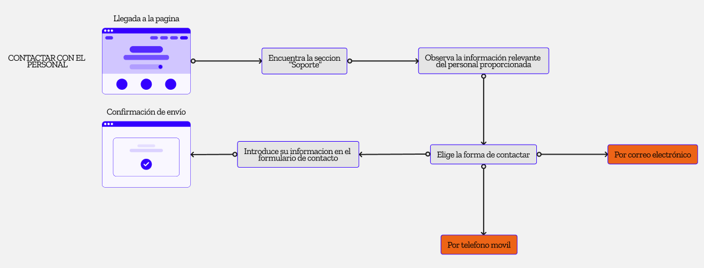
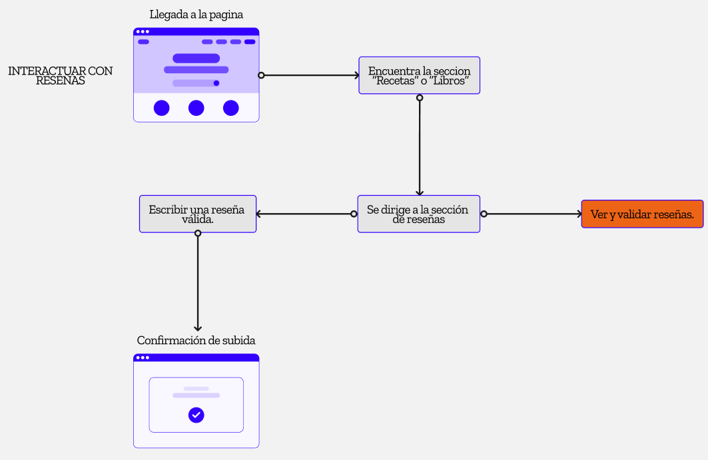

 2.c IA: Sitemap + Labelling 
----

Para identificar y esquematizar todos los elementos de forma sencilla e intuitiva, hemos realizado un mapa estructural de las diferentes secciones y subsecciones y de qué trata cada una, junto a qué se puede acceder desde ellas:

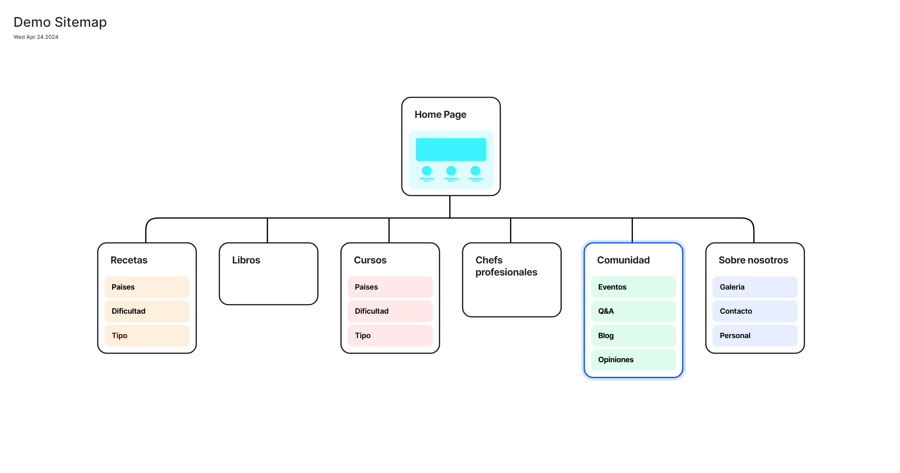
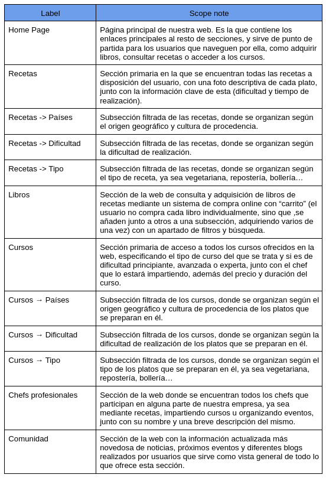
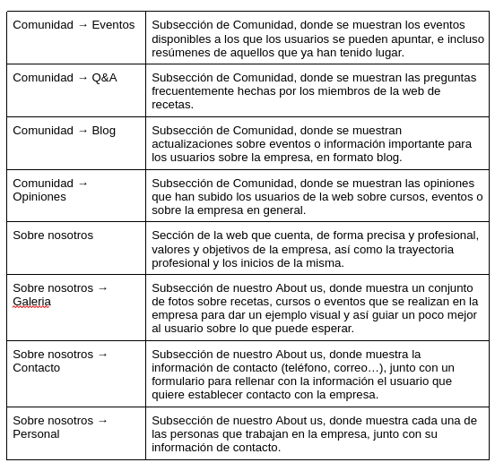

 2.d Wireframes
-----

Por último, hemos propuesto un diseño de una de las secciones más importantes de nuestra web, la página de Recetas, y su diseño adaptado a diferentes estilos y dispositivos.

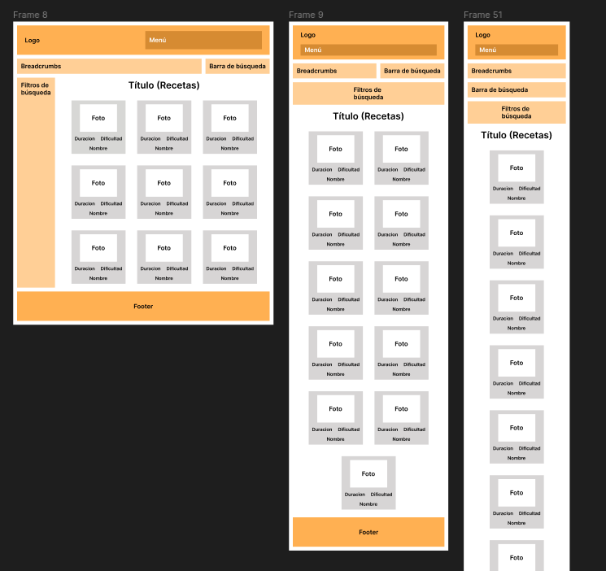
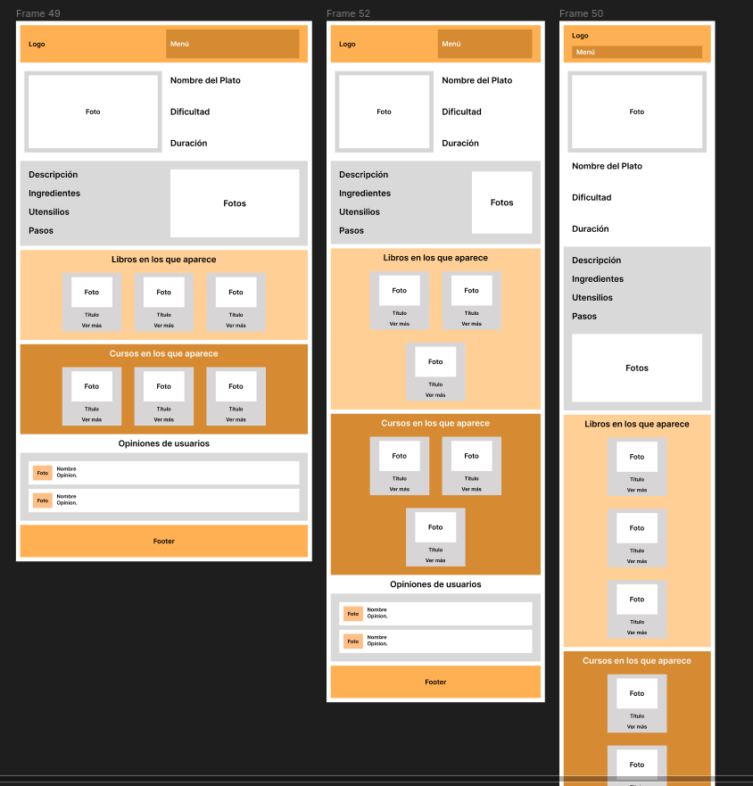

## Paso 3. Mi UX-Case Study (diseño)

 3.a Moodboard
-----

En nuestro moodboard hemos añadido los elementos principales y clave que componen la idea que tenemos de la visualización final de la aplicación. Hemos elegido fotos que considerabamos que transmitían la misma sensación que queremos que los clientes tengan cuando entren en la app, una sensación de calidez y bienestar. La paleta de colores acompaña a esta sensación ya que es visualmente placentera y suave a la vista, además de que recuerda a la cocina. La fuente elegida mezcla el estilo moderno con el facil de leer, es bastante visual. Los comentarios añadidos simulan como queremos que los usarios interactuen con la app. Se puede visualizar mejor en el enlace a figma: [Moodboard](https://www.figma.com/design/nJiKGIodoMkNieeSc88b0c/Untitled?node-id=0-1&t=uPSZLlzsIitvS3xW-0)

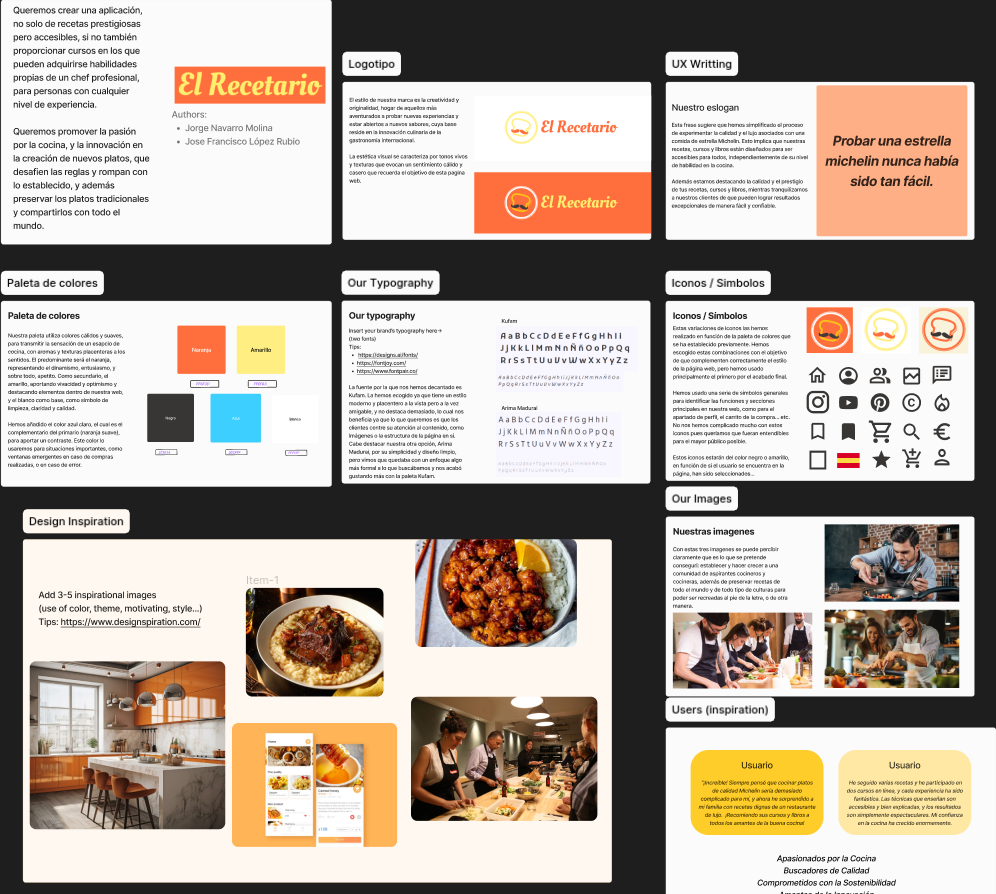

Para el diseño del logotipo, inicialmente utilizamos un generador de logos mediante una IA que, posteriormente, editamos aquel que más nos gustó, resultando en el logotipo finalmente usado en nuestra web. Dicho logotipo puede parecer algo largo, pero encaja bastante bien en las cabeceras de algunas páginas. 

Sin embargo, para la nuestra, lo hemos tenido que adaptar un poco, moviendo el icono encima del texto y alineándolos, de forma que no sea tan ancho. Además, dicho icono funciona a la perfección para encontrarse en diferentes páginas, al ser compacto y sencillo y no necesita del texto para su comprensión.

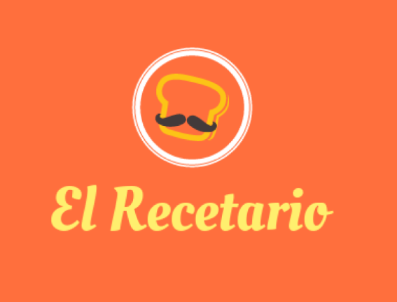
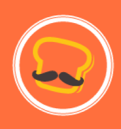

  3.b Landing Page
----

Nuestra landing page esta diseñada para atraer al máximo número de clientes y que estos vengan de distintas comunidades, por lo que se intenta cubrir todos los tipos de públicos, haciendo un landing page genérico y llamativo. En este presentamos claramente los servicios que ofrecemos de una forma amigable e incitamos a probarlos. En la parte final incluimos un boton que redirigirá a la aplicación, junto con el footer con los enlaces relevantes sobre nuestra marca.

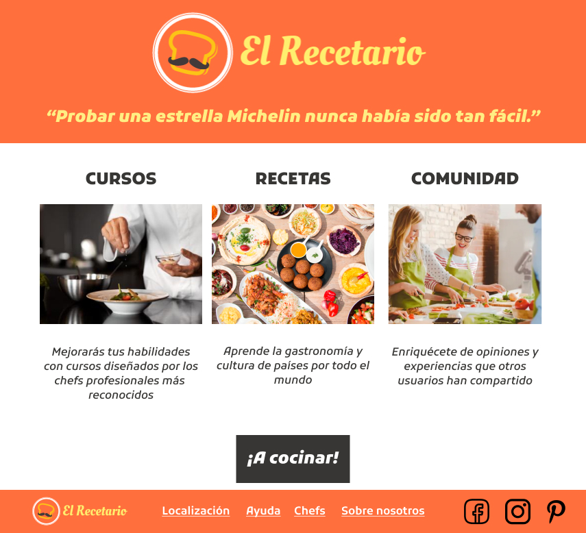

 3.c Guidelines
----

Para nuestro proyecto de diseño de interfaces de usuario, hemos elegido la fuente Kufam debido a su legibilidad y claridad, características cruciales para una buena experiencia de usuario en pantallas digitales. Nuestra paleta de colores se basa en tonos suaves de naranja y amarillo, seleccionados por su asociación con la comida y sus características de transmitir energía, vitalidad y positividad. Estos colores cálidos hacen la aplicación más dinámica y atractiva, proporcionando buen contraste con colores neutros como blanco y gris. Además hemos utilizado varios patrones IU, como las barras de navegación, los carroussel, los campos de texto o las barras de busqueda y botones. Enlace directo: [Guidelines](P3/3.%20Patrones%20y%20guidelines/GUIDELINES.pdf)
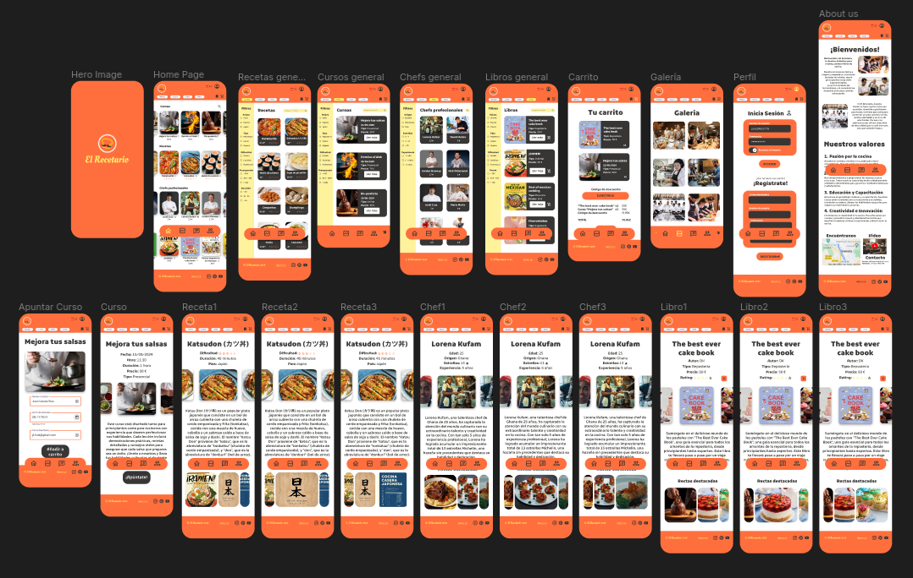

  3.d Mockup

El Mockup que hemos diseñeado permite ver la interacción del usuario con la aplicación. Se puede descargar en el siguiente enlace:
 o mediante la ejecución de la aplicación (botón Play, arriba derecha): [Ejecución](https://www.figma.com/proto/jhw2AZKXEF12lJCMCpxgAk/App?node-id=2-2&t=OIOuDzsn9FaRo7PK-0&scaling=scale-down&page-id=0%3A1&starting-point-node-id=2%3A2). La aplicación se ve de forma general de la siguiente forma:

 3.e ¿My UX-Case Study?
-----

### Origen de la aplicación
Esta aplicación surgió de la idea de ofrecer las maravillas de la gastronomía y todo lo relacionado con este mundo a cualquiera dispuesto por aprender y sorprender, no solo a sus seres queridos si no a si msimo.

### Primeros pasos del proyecto
Al principio cogimos de referencia una pagina web de una escuela de teatro, y la analizamos objetivamente, viendo sus puntos fuertes y sus fallos, indicando las mejoras neecsarias y las funcionalidades útil. Uno de los pasos para esto fue simular el uso de dos usuarios, y ver como sería la interacción con la pagina web. Uno de los usuarios la inventamos como una cocinera la cual quería despejarse de su trabajo demandante y poder disfrutar del arte de la actuación. A partir de esta usuaria coincidimos que para la siguiente práctica hicieramos una empresa de cocina.

### Montando la aplicación
Para ello , usamos varias herramientas y técnicas, como el diseño de un moodboard que plasmara las ideas principales de como queriamos visualizar la app, dandole la personalidad que querimaos que tuviese. Tras esto hicimos un landing page con el objetivo de que los usuarios la vieran y se vieran obligados a entrar a nuestra app e indiagar más en los servicios que ofrece. Finalmente, hicimos una busqueda intensiva sobre los patrones de IU que usar en nuestra app para la
navegación a través de esta, además de añadir un estilo visual mejor.

### Conclusiones
En nuestra ocasión, acabamos haciendo una web de gastronomía tras analizar los aspectos técnicos de una web de teatro. Esto nos ayudó a saber qué objetivo teníamos a la hora de montrar nuestra aplicación, aunque con pocas referencias concretas al tratarse de temas muy diferentes entre sí. La visión de las personas fue un factor clave en la decisión del tema de la web, y de como ésta se iba a enfocar, así como cualidades y facilidades. Gracias a esto, hemos conseguido crear un entorno desde 0, en el que poder vertir los conocimientos adquiridos durante la asignatura y que aspectos positivos queríamos y cuales negativos evitar. Además, esto ha hecho que indaguemos más en el tema gastronómico, especificamente la parte de los cursos y recetarios online, interesándonos más por este tema y sirviendonos de base para muchos elementos.

## Paso 5. Exportación & evaluación con Eye Tracking 

Exportación a HTML/Flutter
-----

 5.b Eye Tracking method 

>>> Indica cómo diseñas experimento y reclutas usuarios (uso de gazerecorder.com)  

Diseño del experimento 
----

>> Uso de imágenes (preferentemente) -> hay que esablecer una duración de visualización y  
>> fijar las áreas de interes (AoI) antes del diseño. Planificar qué tarea debe hacer el usuario (buscar, comprar...) 

  
>> cambiar img por tu diseño de experimento  

>> Recordar que gazerecorder es una versión de pruebas: usar sólo con 3 usuarios para generar mapa de calor (recordar que crédito > 0 para que funcione) 

Resultados y valoración 
-----

>> Cambiar por tus resultados
  

## Paso 4. Evaluación 

 4.a Caso asignado
----

>>> Breve descripción del caso asignado con enlace a  su repositorio Github

 4.b User Testing
----

>>> Seleccione 4 personas ficticias. Exprese las ideas de posibles situaciones conflictivas de esa persona en las propuestas evaluadas. Asigne dos a Caso A y 2 al caso B
 

| Usuarios | Sexo/Edad     | Ocupación   |  Exp.TIC    | Personalidad | Plataforma | TestA/B
| ------------- | -------- | ----------- | ----------- | -----------  | ---------- | ----
| User1's name  | H / 18   | Estudiante  | Media       | Introvertido | Web.       | A 
| User2's name  | H / 18   | Estudiante  | Media       | Timido       | Web        | A 
| User3's name  | M / 35   | Abogado     | Baja        | Emocional    | móvil      | B 
| User4's name  | H / 18   | Estudiante  | Media       | Racional     | Web        | B 

 4.c Cuestionario SUS
----

>>> Usaremos el **Cuestionario SUS** para valorar la satisfacción de cada usuario con el diseño (A/B) realizado. Para ello usamos la [hoja de cálculo](https://github.com/mgea/DIU19/blob/master/Cuestionario%20SUS%20DIU.xlsx) para calcular resultados sigiendo las pautas para usar la escala SUS e interpretar los resultados
http://usabilitygeek.com/how-to-use-the-system-usability-scale-sus-to-evaluate-the-usability-of-your-website/)
Para más información, consultar aquí sobre la [metodología SUS](https://cui.unige.ch/isi/icle-wiki/_media/ipm:test-suschapt.pdf)

>>> Adjuntar captura de imagen con los resultados + Valoración personal 

 4.d Usability Report
----

>> Añadir report de usabilidad para práctica B (la de los compañeros)

>>> Valoración personal 

5.) Conclusion de EVALUACION (A/B testing + usability report + eye tracking) 
----

>> recupera el usability report de tu práctica (que es el caso B de los asignados a otros grupos) 
>> con los resultados del A/B testing, de eye tracking y del usability report:
>>  comentad en 2-3 parrafos cual es la conclusion acerca de la realización de la práctica y su evaluación con esas técnicas y que habéis aprendido

## Conclusión final / Valoración de las prácticas

>>> (90-150 palabras) Opinión FINAL del proceso de desarrollo de diseño siguiendo metodología UX y valoración (positiva /negativa) de los resultados obtenidos  

