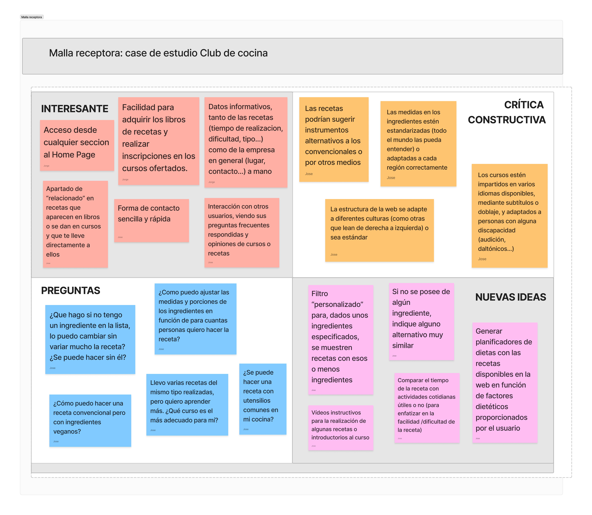
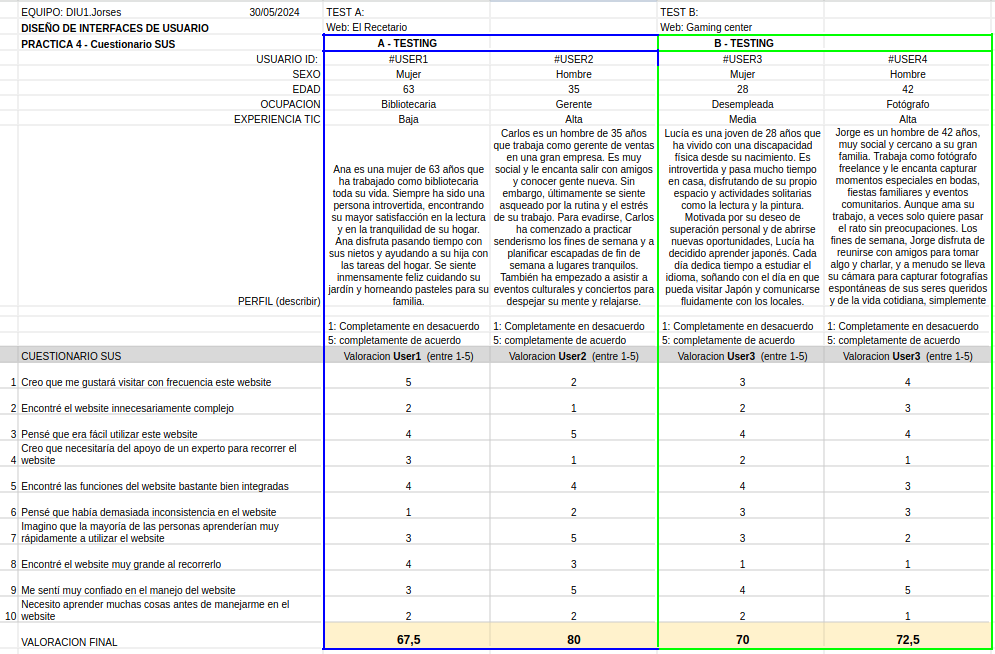
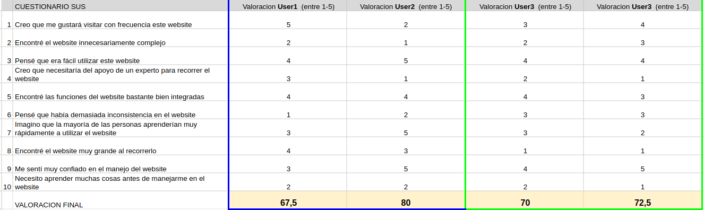
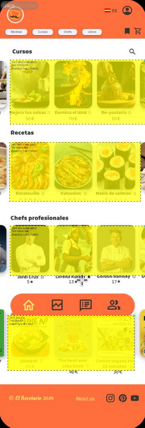
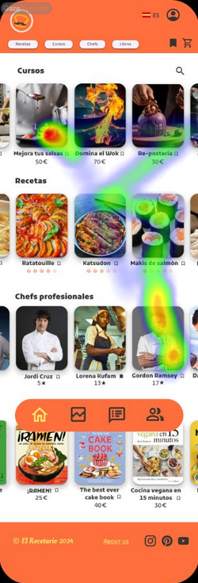
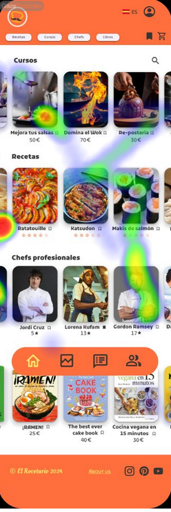
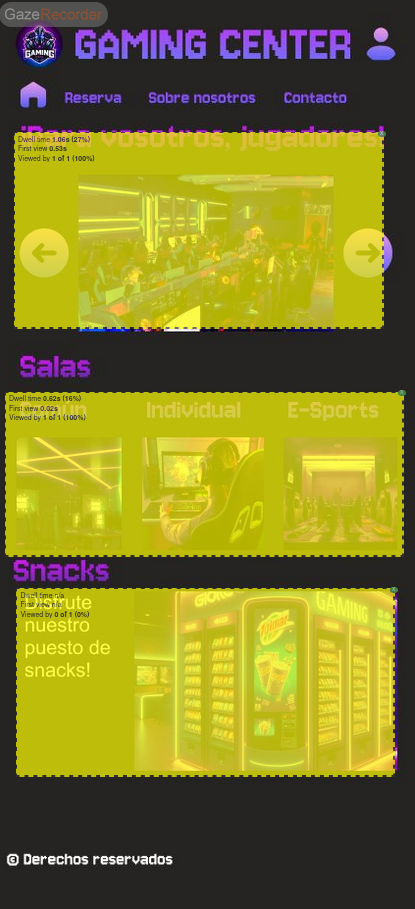
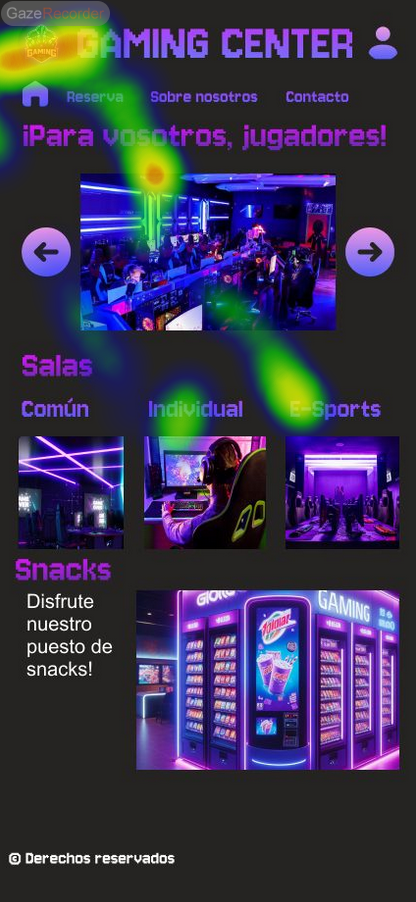
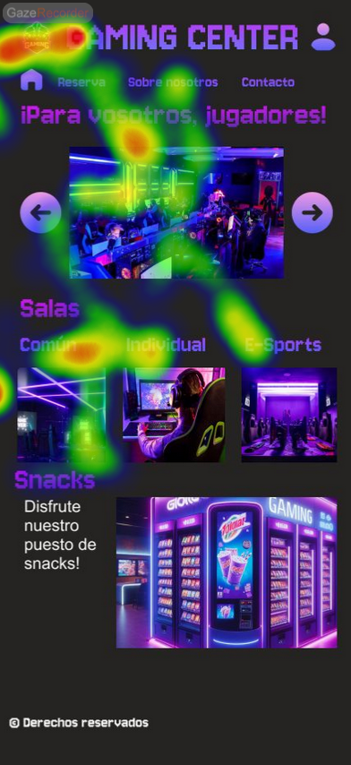

# DIU24
Prácticas Diseño Interfaces de Usuario 2023-24 (Tema: Espacio Escénico Teatral) 

Grupo: DIU1-Jorses.  Curso: 2023/24 
Updated: 25/4/2024

Enlace GitHub: https://github.com/DIU1-Jorses/DIU_P

**Proyecto:** 
# El Recetario

**Descripción:**  
**El Recetario** es una app que celebra tanto la innovación como la autenticidad culinaria, proporcionando una amplia variedad de recetas de diferentes culturas con solo un clic. Además, ofrece una variedad de cursos y eventos gastronómicos, desde clases de cocina oriental hasta talleres de repostería. Nos esforzamos por crear experiencias únicas que permitan a los usuarios sumergirse y aprender sobre la gastronomía de distintas culturas.

Nuestro proyecto consiste en crear una web relacionada con el tema de la gastronomía, cuyo objetivo es asentarse en el mercado, ofreciendo innovación y accesibilidad sencilla y cómoda para nuevos o conocidos públicos. Para ello, recogemos muchas de las necesidades e ideas de usuarios interesados en el tema para sintetizarlas en un sitio web en el que se recogen ideas de recetas, libros y cursos de cocina o interacción con otros usuarios.

Nuestra misión es hacer que la cocina sea accesible, divertida y gratificante para todos. Creemos que cualquiera puede ser un gran cocinero con las recetas adecuadas y un poco de orientación. Por eso, nos esforzamos por ofrecer contenido de alta calidad que no solo instruye, sino que también inspira.

**Logotipo:** 

**Miembros**
 * :bust_in_silhouette:   Jose Francisco López Rubio  [jflrubio4](https://github.com/jflrubio4)         
 * :bust_in_silhouette:  Jorge Navarro Molina [jorgenavmol](https://github.com/jorgenavmol)         

----- 

# Proceso de Diseño 

## Paso 1. UX User & Desk Research & Analisis 

 **1.a User Reseach Plan**
-----

En esta parte hemos analizado, bajo diferentes puntos de vista y de forma general, diferentes páginas web para realizar el estudio de su usabilidad. Esto servirá de base para desarrollar el resto del proyecto y, en cierto punto, realizar una mejora sustancial en la experiencia de usuario.

 1.b Competitive Analysis
-----

Queríamos escoger sitios web alejados de la zona de estudio para ver si en otros lugares también sucedían experiencias similares. Por ejemplo, hemos escogido la pagina de OFF ya que considerabamos que era una web digna de competir y con la que poder comparar debido a su diseño limpio y aspecto profesional, y no difería de lo que buscabamos analizar en nuestra web de referencia. Hemos elegido la web La Estupenda por su pobre diseño e interfaz poco intuitiva para estudiar como poder mejorarla.

 1.c Persona
-----

Hemos escogido personas fuera del ámbito teatral y escénico pero con cierto interés en el tema y con diferentes características para enfocarla desde varios puntos de vista.

 1.d User Journey Map
----

Consideramos estas experiencias pues, en cuanto al trabajo se refiere, es común y lógico anteponerlo al ocio, y hemos querido basar a nuestras personas desde dicho ámbito para servir de ayuda a otros usuarios.

 1.e Usability Review
----
Revisión de usabilidad: 
- Enlace al documento: [Usability Review](P1/4%20-%20Usability%20Review)
- Valoración final (numérica): 63
- Comentario sobre la valoración: La valoracion final es medianamente acpetable, pero bastante mejorable en varios aspectos. Algunos de los puntos mas debiles de la página son el uso obligatorio de un menu interactivo auxiliar, cuya funcionalidad es bastante pobre y podria evitarse de distintas formas, la carencia de ayudas o guias para la navegación por la página web, la vaga organización de la información o la lenta velocidad de la pagina. Y algunos de los puntos mas fuertes de la página son el acceso al sitio web, es decir, es fácilmente encontrable, la claridad con la que se indica la información necesaria a introducir y la facilidad que tiene reservar/apuntarse a una actividad. Es pasable, pero la interfaz principal necesita un cambio urgentemente.

## Paso 2. UX Design  

 2.a Reframing / IDEACION: Feedback Capture Grid / Empathy map 
----

Mediante la anterior práctica, pudimos ver aspectos importantes de una web y realizamos un estudio en diferentes ámbitos de la misma, que nos han servido de base para este nuevo proyecto, tanto qué podría tener o qué se podría mejorar en nuestra página en forma de una malla receptora (Feedback Capture Grid).

  
    
En esta práctica, planteamos como "propuesta de valor" para un nuevo diseño de aplicación para economia colaborativa una pagina web para una empresa de cocina que ofrece tanto recetas, como cursos de cocina para todos los públicos, además de un portal de venta de libros de recetas que oferta, todo realizado por chefs profesionales y reconocidos en el ámbito gastronómico.

 2.b ScopeCanvas
----
Nuestra propuesta de valor se resume en la siguiente imagen:

 2.b User Flow (task) analysis 
-----

A continuación, hemos identificado tareas principales, junto a su relevancia, para diferentes grupos de personas que pueden acceder a nuestro sitio web, así como desarrollado 3 de ellas en varios User Flows:

 2.c IA: Sitemap + Labelling 
----

Para identificar y esquematizar todos los elementos de forma sencilla e intuitiva, hemos realizado un mapa estructural de las diferentes secciones y subsecciones y de qué trata cada una, junto a qué se puede acceder desde ellas:

 2.d Wireframes
-----

Por último, hemos propuesto un diseño de una de las secciones más importantes de nuestra web, la página de Recetas, y su diseño adaptado a diferentes estilos y dispositivos.

## Paso 3. Mi UX-Case Study (diseño)

 3.a Moodboard
-----

En nuestro moodboard hemos añadido los elementos principales y clave que componen la idea que tenemos de la visualización final de la aplicación. Hemos elegido fotos que considerabamos que transmitían la misma sensación que queremos que los clientes tengan cuando entren en la app, una sensación de calidez y bienestar. La paleta de colores acompaña a esta sensación ya que es visualmente placentera y suave a la vista, además de que recuerda a la cocina. La fuente elegida mezcla el estilo moderno con el facil de leer, es bastante visual. Los comentarios añadidos simulan como queremos que los usarios interactuen con la app. Se puede visualizar mejor en el enlace a figma: [Moodboard](https://www.figma.com/design/nJiKGIodoMkNieeSc88b0c/Untitled?node-id=0-1&t=uPSZLlzsIitvS3xW-0)

Para el diseño del logotipo, inicialmente utilizamos un generador de logos mediante una IA que, posteriormente, editamos aquel que más nos gustó, resultando en el logotipo finalmente usado en nuestra web. Dicho logotipo puede parecer algo largo, pero encaja bastante bien en las cabeceras de algunas páginas. 

Sin embargo, para la nuestra, lo hemos tenido que adaptar un poco, moviendo el icono encima del texto y alineándolos, de forma que no sea tan ancho. Además, dicho icono funciona a la perfección para encontrarse en diferentes páginas, al ser compacto y sencillo y no necesita del texto para su comprensión.

  3.b Landing Page
----

Nuestra landing page esta diseñada para atraer al máximo número de clientes y que estos vengan de distintas comunidades, por lo que se intenta cubrir todos los tipos de públicos, haciendo un landing page genérico y llamativo. En este presentamos claramente los servicios que ofrecemos de una forma amigable e incitamos a probarlos. En la parte final incluimos un boton que redirigirá a la aplicación, junto con el footer con los enlaces relevantes sobre nuestra marca.

 3.c Guidelines
----

Para nuestro proyecto de diseño de interfaces de usuario, hemos elegido la fuente Kufam debido a su legibilidad y claridad, características cruciales para una buena experiencia de usuario en pantallas digitales. Nuestra paleta de colores se basa en tonos suaves de naranja y amarillo, seleccionados por su asociación con la comida y sus características de transmitir energía, vitalidad y positividad. Estos colores cálidos hacen la aplicación más dinámica y atractiva, proporcionando buen contraste con colores neutros como blanco y gris. Además hemos utilizado varios patrones IU, como las barras de navegación, los carroussel, los campos de texto o las barras de busqueda y botones. Enlace directo: [Guidelines](P3/3.%20Patrones%20y%20guidelines/GUIDELINES.pdf).

  3.d Mockup
----

El Mockup que hemos diseñeado permite ver la interacción del usuario con la aplicación. Se puede descargar en el siguiente enlace:
 o mediante la ejecución de la aplicación (botón Play, arriba derecha): [Ejecución](https://www.figma.com/proto/jhw2AZKXEF12lJCMCpxgAk/App?node-id=2-2&t=OIOuDzsn9FaRo7PK-0&scaling=scale-down&page-id=0%3A1&starting-point-node-id=2%3A2). La aplicación se ve de forma general de la siguiente forma:

[Enlace al figma del Mockup](https://www.figma.com/design/jhw2AZKXEF12lJCMCpxgAk/App?node-id=0-1&t=OIOuDzsn9FaRo7PK-0)

 3.e ¿My UX-Case Study?
-----

### Origen de la aplicación
Esta aplicación surgió de la idea de ofrecer las maravillas de la gastronomía y todo lo relacionado con este mundo a cualquiera dispuesto por aprender y sorprender, no solo a sus seres queridos si no a si msimo.

### Primeros pasos del proyecto
Al principio cogimos de referencia una pagina web de una escuela de teatro, y la analizamos objetivamente, viendo sus puntos fuertes y sus fallos, indicando las mejoras neecsarias y las funcionalidades útil. Uno de los pasos para esto fue simular el uso de dos usuarios, y ver como sería la interacción con la pagina web. Uno de los usuarios la inventamos como una cocinera la cual quería despejarse de su trabajo demandante y poder disfrutar del arte de la actuación. A partir de esta usuaria coincidimos que para la siguiente práctica hicieramos una empresa de cocina.

### Montando la aplicación
Para ello , usamos varias herramientas y técnicas, como el diseño de un moodboard que plasmara las ideas principales de como queriamos visualizar la app, dandole la personalidad que querimaos que tuviese. Tras esto hicimos un landing page con el objetivo de que los usuarios la vieran y se vieran obligados a entrar a nuestra app e indiagar más en los servicios que ofrece. Finalmente, hicimos una busqueda intensiva sobre los patrones de IU que usar en nuestra app para la
navegación a través de esta, además de añadir un estilo visual mejor.

### Conclusiones
En nuestra ocasión, acabamos haciendo una web de gastronomía tras analizar los aspectos técnicos de una web de teatro. Esto nos ayudó a saber qué objetivo teníamos a la hora de montrar nuestra aplicación, aunque con pocas referencias concretas al tratarse de temas muy diferentes entre sí. La visión de las personas fue un factor clave en la decisión del tema de la web, y de como ésta se iba a enfocar, así como cualidades y facilidades. Gracias a esto, hemos conseguido crear un entorno desde 0, en el que poder vertir los conocimientos adquiridos durante la asignatura y que aspectos positivos queríamos y cuales negativos evitar. Además, esto ha hecho que indaguemos más en el tema gastronómico, especificamente la parte de los cursos y recetarios online, interesándonos más por este tema y sirviendonos de base para muchos elementos.

## Paso 4. Evaluación 

 4.a Caso asignado
----

A nuestro equipo le ha tocado evaluar el proyeto Gaming Center, cuyo propósito es gestionar un club de videojuegos en el que proporcionar experiencias inmersivas en salas comunes o individuales de diferentes videojuegos a elección, ofertando un lugar con las comodidades necesarias para disfrutar del mundo del mundo del gaming.
Enlace GitHub: https://github.com/AntonioFdez03/PracticasDIU

 4.b User Testing
----
 

| Usuarios | Sexo/Edad     | Ocupación      |  Exp.TIC    | Personalidad | Plataforma | TestA/B
| ------------- | -------- | -----------    | ----------- | -----------  | ---------- | ----
| Ana      | M  | 63       | Bibliotecaria  | Baja        | Emocional    | Móvil      | A 
| Carlos   | H  | 35       | Gerente        | Alta        | Extrovertido | Linux      | A 
| Lucia    | M  | 28       | Desempleada    | Media       | Introvertida | Windows    | B 
| Jorge    | H  | 42       | Fotógrafo      | Alta        | Racional     | Mac        | B

Descripción: Ana es una mujer de 68 años que ha trabajado como bibliotecaria toda su vida. Siempre ha sido una persona introvertida, encontrando su mayor satisfacción en la lectura y en la tranquilidad de su hogar. Ana disfruta pasando tiempo con sus nietos y ayudando a su hija con las tareas del hogar. Se siente inmensamente feliz cuidando su jardín y horneando pasteles para su familia. Ana ha decidido dedicar su jubilación a disfrutar de actividades que le traen alegría, como asistir a clases de baile para mayores y organizar reuniones familiares llenas de risas y buenos momentos.

Descripción: Carlos es un hombre de 35 años que trabaja como gerente de ventas en una gran empresa. Es muy social y le encanta salir con amigos y conocer gente nueva. Sin embargo, últimamente se siente asqueado por la rutina y el estrés de su trabajo. Para evadirse, Carlos ha comenzado a practicar senderismo los fines de semana y a planificar escapadas de fin de semana a lugares tranquilos. También ha empezado a asistir a eventos culturales y conciertos para despejar su mente y relajarse.

Descripción: Lucía es una joven de 28 años que ha vivido con una discapacidad física desde su nacimiento. Es introvertida y pasa mucho tiempo en casa, disfrutando de su propio espacio y actividades solitarias como la lectura y la pintura. Motivada por su deseo de superación personal y de abrirse nuevas oportunidades, Lucía ha decidido aprender japonés. Cada día dedica tiempo a estudiar el idioma, soñando con el día en que pueda visitar Japón y comunicarse fluidamente con los locales.

Descripción: Jorge es un hombre de 42 años, muy social y cercano a su gran familia. Trabaja como fotógrafo freelance y le encanta capturar momentos especiales en bodas, fiestas familiares y eventos comunitarios. Aunque ama su trabajo, a veces solo quiere pasar el rato sin preocupaciones. Los fines de semana, Jorge disfruta de reunirse con amigos para tomar algo y charlar, y a menudo se lleva su cámara para capturar fotografías espontáneas de sus seres queridos y de la vida cotidiana, simplemente disfrutando el momento sin presiones.

 4.c Cuestionario SUS
----

Se ha usado la plantilla descrita en el github del profesor, en formato .xlsx, para rellenar las diferentes columnas para los diferentes usuarios, se puede ver de forma directa pinchando [aquí](https://github.com/DIU1-Jorses/DIU_P/blob/master/P4/3.%20Cuestionario%20SUS/Cuestionario%20SUS.pdf).

 4.d Eye Tracking method 
----

Hemos cogido a los 4 usuarios definidos y les hemos dado la tarea de enfocarse en lo que más le atraiga de la página que estén observando, o al menos, lo primero que visualicen. Estas pruebas se pueden observar en la carpeta [2. EyeTracking](https://github.com/DIU1-Jorses/DIU_P/tree/master/P4/2.%20Eye%20Tracking) (siendo test A los test realizados a nuestra web y test B los realizados al que se nos ha asignado, Gaming Center).
Las imágenes están insertadas en la siguiente sección, el Usability Report.

 4.d Usability Report
----

Esta parte está especificada en el fichero: [Usability-Report24.md](https://github.com/DIU1-Jorses/DIU_P/blob/master/P4/4.%20Usability%20Report/Usability-Report24.md)

### Gaming Center

### (30/05/2024)

Enlace GitHub: https://github.com/AntonioFdez03/PracticasDIU

### Realizado por:

Informe realizado por Equipo DIU1_Jorses.

## 1 DESCRIPCIÓN DEL WEBSITE

El propósito de la app revisada es proporcionar experiencias inmersivas en salas comunes o individuales de diferentes videojuegos a elección, ofertando un lugar con las comodidades necesarias para disfrutar del mundo del mundo del gaming.

## 2 RESUMEN EJECUTIVO

El proyecto trata de un club de videojuegos dedicado a expandir y explorar nuevos géneros dentro del mundillo, tanto a nivel de usuario como a nivel de producto. Para ello, se ofrecen diferentes salas especializadas (común, individual o e-sport) en las que los distintos usuarios pueden hacer uso de las experiencias ofertadas. Todo ello está sustentado mediante un diseño visual moderno y tecnológico, con una paleta de colores cuya base es el morado, y una tipografía que recuerda a los píxeles de un ordenador, un toque bastante acertado.
la tipografía

Algunos de los problemas detectados podrían ser la ausencia de algún color de contraste, pues todos los usados resaltan sobre fondo negro pero no se diferencia un color del resto si se quiere dar énfasis, y el uso de una segunda tipografía para la web que no encaja con la dinámica visual.

## 3 METODOLOGIA 

#### Metodología de usabililidad

Las técnicas aplicadas han sido varias. Se han construido 4 perfiles ficticios con distintos rasgos, atribuidos de forma aleatoria lanzando unos dados especiales. A través de esto conseguimos tener 4 puntos de vista distintos sobre la aplicación "Gaming Center",  retratado claramente en las conclusiones del cuestionario SUS. 

También hemos utilizado una herramienta de Internet, "Gaze recorder", cuya tecnología obtiene los puntos principales a los que mira el sujeto y así saber si el diseño de dicha aplicación cumple con sus propósitos.

#### Test de usuarios: Participantes

| Usuarios | Sexo/Edad     | Ocupación      |  Exp.TIC    | Personalidad | Plataforma | TestA/B
| ------------- | -------- | -----------    | ----------- | -----------  | ---------- | ----
| Ana      | M  | 63       | Bibliotecaria  | Baja        | Emocional    | Móvil      | A 
| Carlos   | H  | 35       | Gerente        | Alta        | Extrovertido | Linux      | A 
| Lucia    | M  | 28       | Desempleada    | Media       | Introvertida | Windows    | B 
| Jorge    | H  | 42       | Fotógrafo      | Alta        | Racional     | Mac        | B 

Descripción: Ana es una mujer de 68 años que ha trabajado como bibliotecaria toda su vida. Siempre ha sido una persona introvertida, encontrando su mayor satisfacción en la lectura y en la tranquilidad de su hogar. Ana disfruta pasando tiempo con sus nietos y ayudando a su hija con las tareas del hogar. Se siente inmensamente feliz cuidando su jardín y horneando pasteles para su familia. Ana ha decidido dedicar su jubilación a disfrutar de actividades que le traen alegría, como asistir a clases de baile para mayores y organizar reuniones familiares llenas de risas y buenos momentos.

Descripción: Carlos es un hombre de 35 años que trabaja como gerente de ventas en una gran empresa. Es muy social y le encanta salir con amigos y conocer gente nueva. Sin embargo, últimamente se siente asqueado por la rutina y el estrés de su trabajo. Para evadirse, Carlos ha comenzado a practicar senderismo los fines de semana y a planificar escapadas de fin de semana a lugares tranquilos. También ha empezado a asistir a eventos culturales y conciertos para despejar su mente y relajarse.

Descripción: Lucía es una joven de 28 años que ha vivido con una discapacidad física desde su nacimiento. Es introvertida y pasa mucho tiempo en casa, disfrutando de su propio espacio y actividades solitarias como la lectura y la pintura. Motivada por su deseo de superación personal y de abrirse nuevas oportunidades, Lucía ha decidido aprender japonés. Cada día dedica tiempo a estudiar el idioma, soñando con el día en que pueda visitar Japón y comunicarse fluidamente con los locales.

Descripción: Jorge es un hombre de 42 años, muy social y cercano a su gran familia. Trabaja como fotógrafo freelance y le encanta capturar momentos especiales en bodas, fiestas familiares y eventos comunitarios. Aunque ama su trabajo, a veces solo quiere pasar el rato sin preocupaciones. Los fines de semana, Jorge disfruta de reunirse con amigos para tomar algo y charlar, y a menudo se lleva su cámara para capturar fotografías espontáneas de sus seres queridos y de la vida cotidiana, simplemente disfrutando el momento sin presiones.

#### Resultados obtenidos

Los resultados obtenidos corresponden al orden de presentación de los usuarios en la tabla, correspondiéndose Ana y Carlos al test A (Nuestro Proyecto) y Lucía y Jorge al test B (Proyecto a evaluar):

Los resultados del eye tracking en los diferentes test son los siguientes. Para el test A:

Y para el test B:

## 4 CONCLUSIONES 

A partir de los resultados de las pruebas de usabilidad efectuadas a lo largo de esta práctica, hemos podido extraer varias conclusiones:

- Es una buena idea de proyecto, sin embargo la ejecución/diseño de la app no la consideramos la mejor, sino que podría haberse desarrollado bastante más. 

- Buena temática y colores elegidos, así como una tipografía muy acertada.

- Readme poco relleno.

#### Incidencias

* En la parte del User Flow, solo está descrita una acción, en contraste a las tres mínimamente requeridas.

#### Valoración 

* Buena temática y los colores son muy acertados y acorde al tema elegido. La tipografía, consideramos que es de las mejores que se podrían haber usado. Además, los iconos elegidos son simples, pero funcionan muy bien.

* Buen diseño para realizar la eleccion de los datos de las reservas (uso de varios patrones IU, como campos de texto o elección de hora).

#### Recomendaciones y propuesta de mejoras: 

* Readme poco relleno. Deberían de ponerse comentarios y especificaciones en diferentes partes del readme que no se encuentran rellenas (como conclusiones o comentarios a fotos que no están).

* Las paginas de "Contáctanos" y "Sobre nosotros" varían algo con los wireframes especificados en la práctica anterior y, aunque pueden haber cambiado de opinión, creemos que deben de servir de base para el diseño final.

#### Valoración de la prueba de usabilidad (self-assesment)

Consideramos que estas técnicas si han sido bastante útiles a la hora de evaluar el diseño y la usabilidad de la aplicación. Esto ha servido para ofrecer un punto de vista diferente, lo que ayuda a hallar fallos que bajo una percepción del creador no podrían ser detectados y mejorar aspectos que no hubieran sido considerados.

 5. Conclusion de EVALUACION (A/B testing + usability report + eye tracking) 
----

Evaluar nuestro proyecto, a la par que el proyecto asignado, junto a la perspectiva de 4 diferentes usuarios, nos ha ayudado a entender y profundizar de una forma más intensiva nuestro proyecto, a la vez que hemos podido evaluar con mejor habilidad el otro proyecto al tener una base sobre la que fijarnos. Creemos que las técnicas utilizadas han sido muy útiles para evaluar el diseño y la usabilidad de la aplicación. Han proporcionado una perspectiva diferente que ayuda a identificar errores que el creador no habría notado y a mejorar aspectos que de otro modo no habrían sido considerados.

Los test de Eye Tracking nos han resultado muy interesantes pues así vemos de una forma más visual y práctica como diferentes usuarios observan aspectos esenciales en nuestra web de formas que no se habían ni llegado a contemplar, ayudando a mejorar su diseño y usabilidad.

## Conclusión final / Valoración de las prácticas

La evaluación ha mostrado que, aunque el proyecto cuenta con una base sólida y varios aspectos positivos, hay áreas clave que requieren mejoras. Al seguir las recomendaciones y continuar desarrollando la aplicación, el equipo puede asegurar que el proyecto no solo cumpla con las expectativas de los usuarios, sino que también ofrezca una experiencia excepcional y coherente.

En general, la prueba de usabilidad ha sido valiosa para identificar áreas importantes y proporcionar un camino claro hacia la mejora continua del proyecto (en caso de hacerse). Con las correcciones y mejoras adecuadas, el proyecto tiene el potencial de ser una herramienta poderosa y atractiva en el mundo del gaming. Además, todas estas pruebas han hecho enriquecernos en los temas de usabilidad y diseño de interfaces de las páginas web, lo que nos ha ayudado a poder crear un proyecto desde 0 y volcar nuestros conocimientos en su aspecto visual mediante un enfoque práctico y eficiente.
